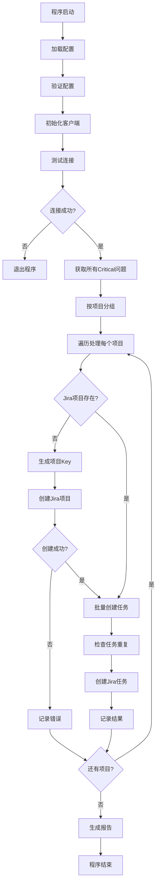
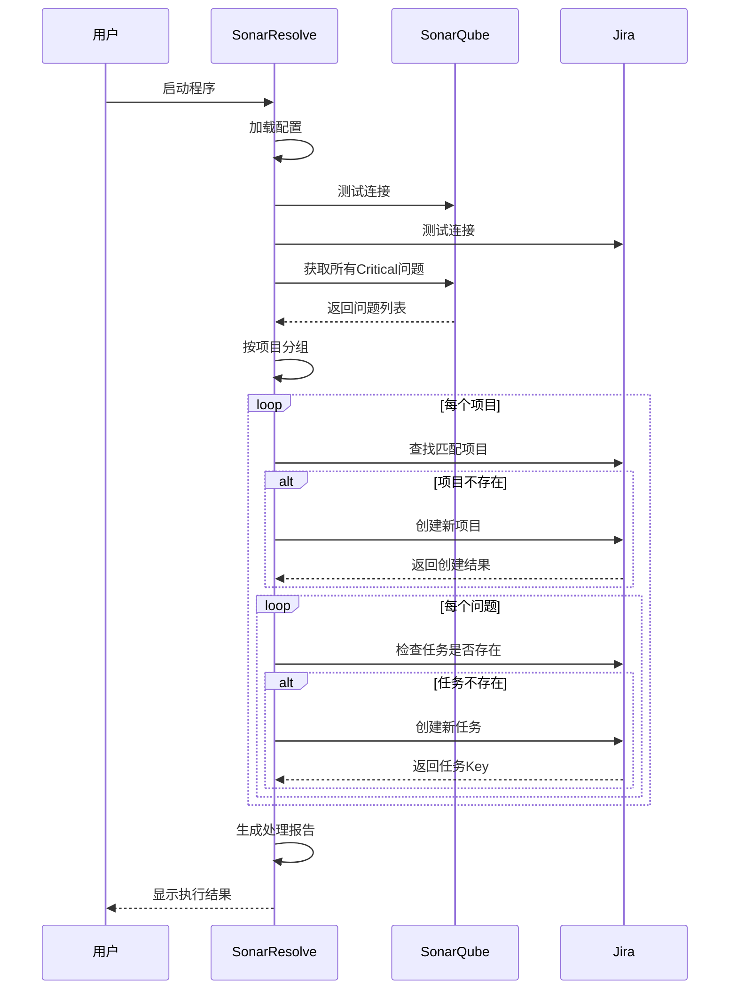
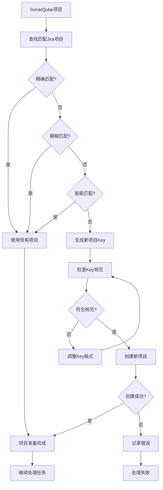
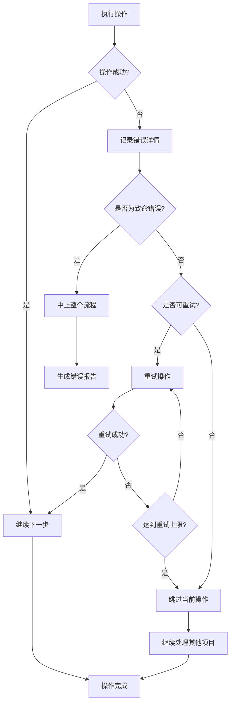
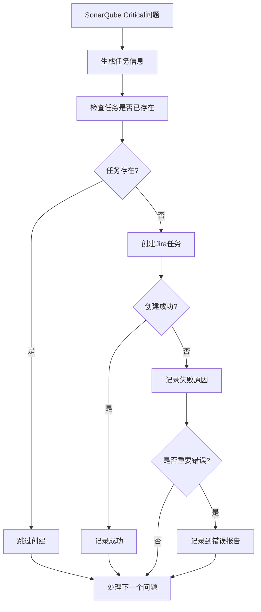
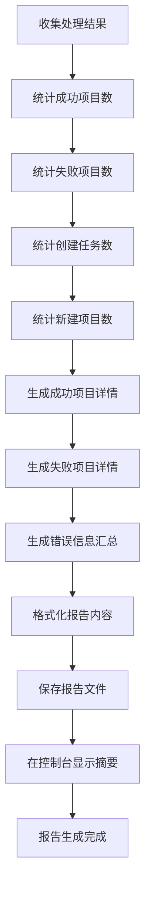
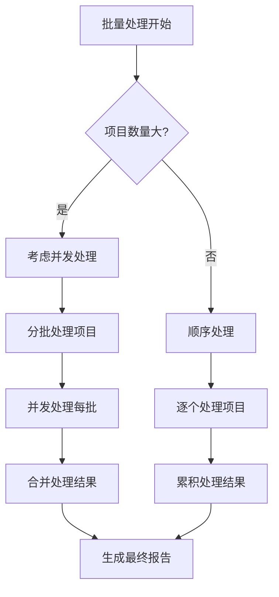
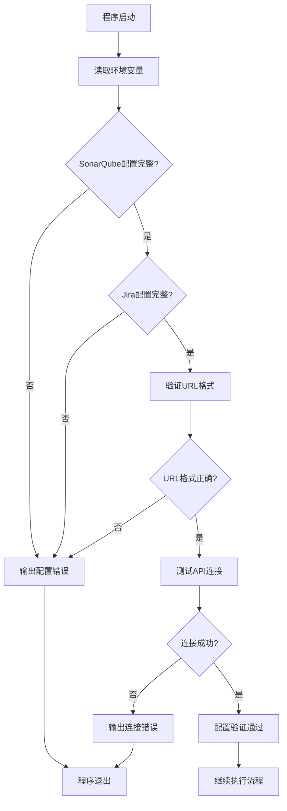

# SonarQube到Jira任务创建流程图

## 整体架构流程

```mermaid
graph TD
    A[程序启动] --> B[加载配置]
    B --> C[验证配置]
    C --> D[初始化客户端]
    D --> E[测试连接]
    E --> F{连接成功?}
    F -->|否| G[退出程序]
    F -->|是| H[获取所有Critical问题]
    
    H --> I[按项目分组]
    I --> J[遍历处理每个项目]
    
    J --> K{Jira项目存在?}
    K -->|否| L[生成项目Key]
    L --> M[创建Jira项目]
    M --> N{创建成功?}
    N -->|否| O[记录错误]
    N -->|是| P[批量创建任务]
    K -->|是| P
    
    P --> Q[检查任务重复]
    Q --> R[创建Jira任务]
    R --> S[记录结果]
    S --> T{还有项目?}
    T -->|是| J
    T -->|否| U[生成报告]
    U --> V[程序结束]
    
    O --> T
```

## 详细数据流程

```mermaid
sequenceDiagram
    participant User as 用户
    participant App as SonarResolve
    participant SQ as SonarQube
    participant Jira as Jira
    
    User->>App: 启动程序
    App->>App: 加载配置
    App->>SQ: 测试连接
    App->>Jira: 测试连接
    
    App->>SQ: 获取所有Critical问题
    SQ-->>App: 返回问题列表
    
    App->>App: 按项目分组
    
    loop 每个项目
        App->>Jira: 查找匹配项目
        alt 项目不存在
            App->>Jira: 创建新项目
            Jira-->>App: 返回创建结果
        end
        
        loop 每个问题
            App->>Jira: 检查任务是否存在
            alt 任务不存在
                App->>Jira: 创建新任务
                Jira-->>App: 返回任务Key
            end
        end
    end
    
    App->>App: 生成处理报告
    App-->>User: 显示执行结果
```

## 项目匹配逻辑

```mermaid
graph TD
    A[SonarQube项目] --> B[查找匹配Jira项目]
    B --> C{精确匹配?}
    C -->|是| D[使用现有项目]
    C -->|否| E{模糊匹配?}
    E -->|是| D
    E -->|否| F{智能匹配?}
    F -->|是| D
    F -->|否| G[生成新项目Key]
    
    G --> H[检查Key规范]
    H --> I{符合规范?}
    I -->|否| J[调整Key格式]
    J --> H
    I -->|是| K[创建新项目]
    K --> L{创建成功?}
    L -->|是| M[项目准备完成]
    L -->|否| N[记录错误]
    
    D --> M
    N --> O[处理失败]
    M --> P[继续处理任务]
```

## 错误处理流程

```mermaid
graph TD
    A[执行操作] --> B{操作成功?}
    B -->|是| C[继续下一步]
    B -->|否| D[记录错误详情]
    D --> E{是否为致命错误?}
    E -->|是| F[中止整个流程]
    E -->|否| G{是否可重试?}
    G -->|是| H[重试操作]
    G -->|否| I[跳过当前操作]
    H --> J{重试成功?}
    J -->|是| C
    J -->|否| K{达到重试上限?}
    K -->|是| I
    K -->|否| H
    I --> L[继续处理其他项目]
    F --> M[生成错误报告]
    C --> N[操作完成]
    L --> N
```

## 任务创建逻辑

```mermaid
graph TD
    A[SonarQube Critical问题] --> B[生成任务信息]
    B --> C[检查任务是否已存在]
    C --> D{任务存在?}
    D -->|是| E[跳过创建]
    D -->|否| F[创建Jira任务]
    F --> G{创建成功?}
    G -->|是| H[记录成功]
    G -->|否| I[记录失败原因]
    
    E --> J[处理下一个问题]
    H --> J
    I --> K{是否重要错误?}
    K -->|是| L[记录到错误报告]
    K -->|否| J
    L --> J
```

## 报告生成流程

```mermaid
graph TD
    A[收集处理结果] --> B[统计成功项目数]
    B --> C[统计失败项目数]
    C --> D[统计创建任务数]
    D --> E[统计新建项目数]
    E --> F[生成成功项目详情]
    F --> G[生成失败项目详情]
    G --> H[生成错误信息汇总]
    H --> I[格式化报告内容]
    I --> J[保存报告文件]
    J --> K[在控制台显示摘要]
    K --> L[报告生成完成]
```

## 并发处理考虑

```mermaid
graph TD
    A[批量处理开始] --> B{项目数量大?}
    B -->|是| C[考虑并发处理]
    B -->|否| D[顺序处理]
    
    C --> E[分批处理项目]
    E --> F[并发处理每批]
    F --> G[合并处理结果]
    G --> H[生成最终报告]
    
    D --> I[逐个处理项目]
    I --> J[累积处理结果]
    J --> H
```

## 配置验证流程

```mermaid
graph TD
    A[程序启动] --> B[读取环境变量]
    B --> C{SonarQube配置完整?}
    C -->|否| D[输出配置错误]
    C -->|是| E{Jira配置完整?}
    E -->|否| D
    E -->|是| F[验证URL格式]
    F --> G{URL格式正确?}
    G -->|否| D
    G -->|是| H[测试API连接]
    H --> I{连接成功?}
    I -->|否| J[输出连接错误]
    I -->|是| K[配置验证通过]
    
    D --> L[程序退出]
    J --> L
    K --> M[继续执行流程]
```

这些流程图清晰地展示了整个系统的工作原理，从初始化到最终报告生成的每个步骤都有详细的说明。
